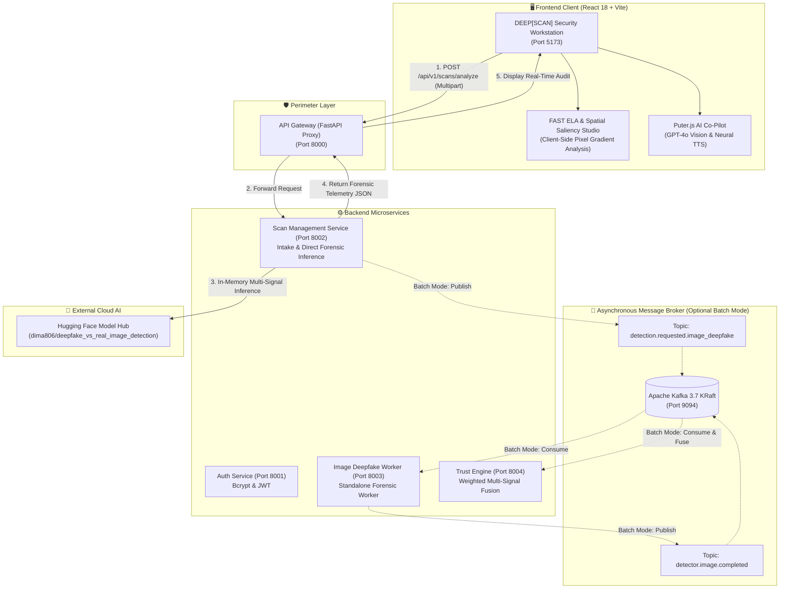
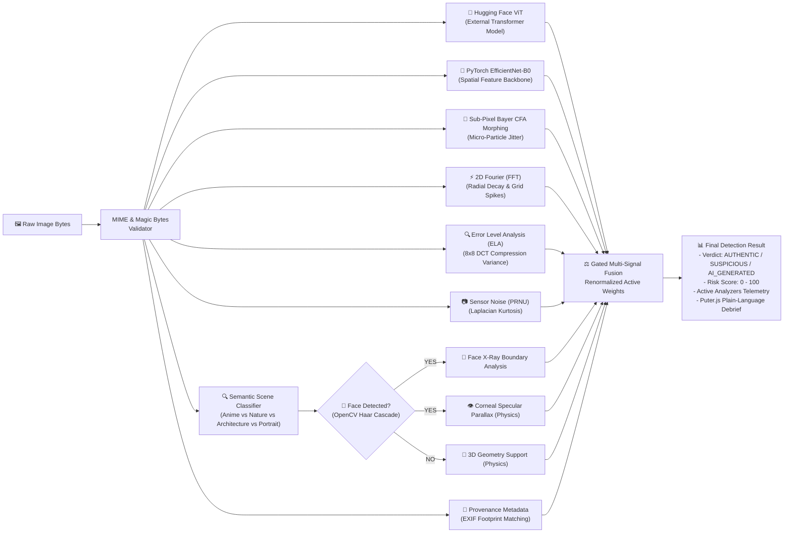

# DEEP[SCAN] — TrustNet AI Forensic Platform

[](https://python.org)
[](https://fastapi.tiangolo.com)
[](https://pytorch.org)
[](https://opencv.org)
[](https://huggingface.co)
[](https://puter.com)
[](https://react.dev)
[](https://kafka.apache.org)
[-brightgreen.svg)](https://pytest.org)

**DEEP[SCAN]** (by **TrustNet AI**) is an enterprise cyber-forensic media authentication platform combining **Hugging Face Vision Transformers**, **PyTorch Convolutional Backbones**, **OpenCV Computer Vision Engines**, **Digital Signal Processing (2D Fourier FFT & ELA)**, **Sub-Pixel Bayer CFA Morphing**, and **Puter.js Explainable AI Co-Pilot** into a unified multi-signal security workstation.

---

## 🏛️ System Architecture & Data Flow

DEEP[SCAN] provides two operational execution paths:
1. **Interactive Synchronous Workstation (Primary UI Path)**: Direct sub-second analysis via FastAPI Reverse Proxy to the in-memory Multi-Signal Forensic Detector.
2. **Asynchronous Message Pipeline (Headless / Batch Path)**: Event-driven ingestion over Apache Kafka 3.7 KRaft for queue processing across dedicated microservice workers.



---

## 🔬 Multi-Signal Forensic Detection Pipeline



---

## 🧪 Forensic Signal Modules Breakdown

| Layer | Module Path | Classification | Methodology & Target |
|---|---|---|---|
| **Hugging Face Hub** | `models/image_deepfake/inference/huggingface_client.py` | **External ML Model** | Vision Transformer (`dima806/deepfake_vs_real_image_detection`) trained on deepfake benchmarks. |
| **Convolutional Backbone** | `models/image_deepfake/inference/efficientnet_detector.py` | **Neural Feature Core** | Extracts 1280-dim spatial convolutional representations via PyTorch `EfficientNet-B0`. |
| **Multi-Scale Gabor Bank** | `models/image_deepfake/forensics/gabor_analyzer.py` | **Texture Forensics** | 8 zero-mean Gabor filter bank (0°, 45°, 90°, 135°) measuring directional entropy & micro-smoothing. |
| **2D Fourier Frequency (FFT)**| `models/image_deepfake/forensics/frequency_analyzer.py` | **DSP / Frequency** | 1D radially averaged power-law ($1/f^\alpha$) decay baseline & high-frequency grid spike ($>2.5\sigma$) detection. |
| **Face Detection & X-Ray** | `models/image_deepfake/forensics/face_analyzer.py` | **Computer Vision** | OpenCV Haar Cascade detection + 22% expanded boundary margin + Face X-Ray step gradient analysis. |
| **Optics Physics (Specular)**| `models/image_deepfake/forensics/physics_eye_reflection_analyzer.py` | **Optics Physics** | Haar cascade eye detection + corneal specular highlight vector dot-product consistency. |
| **Geometry Physics (Support)**| `models/image_deepfake/forensics/geometry_physics_analyzer.py` | **Geometric Physics** | OpenCV ORB bilateral feature symmetry + ground-plane edge density contact analysis. |
| **Sub-Pixel Bayer CFA** | `models/image_deepfake/forensics/pixel_morphing_analyzer.py` | **DSP / Micro-Forensics**| Detects broken $2\times 2$ Bayer demosaicing patterns and 2nd-order Laplacian micro-jitter. |
| **Error Level Analysis (ELA)** | `models/image_deepfake/forensics/ela_analyzer.py` | **Forensic Heuristic** | 8x8 DCT recompression variance across spatial tiles to identify localized splicing. |
| **Sensor Pattern Noise (PRNU)**| `models/image_deepfake/forensics/noise_analyzer.py` | **Forensic Heuristic** | High-pass Laplacian noise residue & kurtosis measuring hardware silicon sensor consistency. |
| **Provenance Metadata (EXIF)**| `models/image_deepfake/forensics/metadata_analyzer.py` | **Metadata Forensics** | Software tag and EXIF extraction (detects deterministic "Midjourney", "Stable Diffusion" footprints). |
| **Semantic Context Gating**| `models/image_deepfake/forensics/scene_analyzer.py` | **Gating / Routing** | Gated decision tree classifying media type to dynamically configure forensic weights. |

---

## 🧠 Puter.js AI Explainable Co-Pilot

Integrated into `frontend/src/services/puterAI.ts` using the **Puter.js AI SDK**:
- **Automated Forensic Debriefs**: Synthesizes Fourier, ELA, noise, and Hugging Face telemetry into plain-English analytical reports.
- **Multimodal Vision Second Opinion**: Evaluates visual lighting, anatomical consistency, and reflections via GPT-4o Vision.
- **Neural Text-to-Speech (TTS)**: Reads debriefings aloud via natural neural audio voices.

---

## 👥 Local Development & Teammate Setup Guide

Welcome to the TrustNet AI development team! If you are new to the project or setting this up on your computer for the first time, follow this step-by-step guide carefully. 

The project has two main parts:
1. **The Backend (Python)**: This contains the Deepfake ML models, the Trust Engine, and the API routing. It requires Python and a Virtual Environment.
2. **The Frontend (React/Node.js)**: This is the user interface you interact with in your browser. It requires Node.js.

### 1. Prerequisites Checklist
Before you do anything, ensure you have these installed on your computer:
- **Git** ([Download Git](https://git-scm.com/))
- **Python 3.11 or newer** ([Download Python](https://www.python.org/downloads/)) — *Make sure to check "Add Python to PATH" during installation!*
- **Node.js 18 or newer** ([Download Node.js](https://nodejs.org/)) — *This installs `npm`, which we need for the frontend.*
- **Docker Desktop** ([Download Docker](https://www.docker.com/products/docker-desktop/)) — *Required for the Kafka message broker.*

---

### 2. Backend Setup & Installation (Python)

The backend code is divided into several folders under `services/` (like `auth`, `trust_engine`, etc.). Instead of installing dependencies directly to your computer, we use a **Virtual Environment (`.venv`)** to keep things isolated.

Open your terminal in the **root folder** of the project (`TrustNet/`) and run:

```bash
# Step 1: Create a Python virtual environment in the root folder
python -m venv .venv

# Step 2: Activate the virtual environment
# On Windows PowerShell:
.venv\Scripts\Activate.ps1
# On Windows Command Prompt:
.venv\Scripts\activate.bat
# On macOS/Linux:
source .venv/bin/activate

# (You will know it worked if your terminal prompt now starts with "(.venv)")

# Step 3: Install the "shared" internal library (CRITICAL STEP!)
pip install -e shared/

# Step 4: Install all the required packages for the backend microservices.
# These commands read the `requirements.txt` files located inside each service folder.
pip install -r services/auth/requirements.txt
pip install -r services/scan_management/requirements.txt
pip install -r services/image_deepfake/requirements.txt
pip install -r services/trust_engine/requirements.txt
pip install -r gateway/requirements.txt

# Step 5: Install general environment packages
pip install python-dotenv huggingface_hub
```

---

### 3. Frontend Setup & Installation (Node.js/React)

The frontend code lives exclusively inside the `frontend/` folder. It uses `npm` (Node Package Manager) to download all the required Javascript libraries (like React, TailwindCSS, etc.) into a hidden `node_modules` folder.

Keep your terminal open and run:

```bash
# Step 1: Move into the frontend directory
cd frontend

# Step 2: Install all frontend dependencies
# This reads the frontend/package.json file and downloads everything needed.
npm install

# Step 3: Move back to the root directory when done
cd ..
```

---

### 4. Environment Configuration (`.env`)

You need a `.env` file to hold secret keys and port numbers. Create a new file named exactly `.env` in the root `TrustNet/` directory and paste this inside:

```env
# Hugging Face Model Hub Credentials (Used by the AI models)
HUGGINGFACE_API_KEY=hf_YOUR_TOKEN_HERE
HF_DEEPFAKE_MODEL=dima806/deepfake_vs_real_image_detection

# Gateway & Microservice Routing
API_GATEWAY_URL=http://localhost:8000
AUTH_SERVICE_URL=http://localhost:8001
SCAN_MANAGEMENT_URL=http://localhost:8002
IMAGE_DEEPFAKE_URL=http://localhost:8003
TRUST_ENGINE_URL=http://localhost:8004

# Message Broker (Kafka)
KAFKA_BOOTSTRAP_SERVERS=localhost:9094
```

---

### 5. Running the Full Platform Locally

Now that everything is installed, you need to start the servers! 

#### ⚡ Option A: Fast 1-Click Launch (Recommended)
We have created automated scripts that will boot up Docker, start all 5 Python backend services, and launch the React frontend all at once.

- **Windows (PowerShell)**:
  ```powershell
  .\start-dev.bat
  # Or you can just double-click start-dev.bat in your file explorer!
  ```
- **Linux / macOS**:
  ```bash
  chmod +x start-dev.sh
  ./start-dev.sh
  ```

#### 🖥️ Option B: Manual Terminal Launch
If you want to see the logs for each service individually, you can open 7 separate terminal windows and run these commands (make sure the `.venv` is activated in the Python terminals!):

1. **Terminal 1 (Kafka in Docker)**: `docker compose up -d kafka`
2. **Terminal 2 (API Gateway)**: `uvicorn gateway.app.main:app --port 8000 --reload`
3. **Terminal 3 (Auth Service)**: `uvicorn services.auth.app.main:app --port 8001 --reload`
4. **Terminal 4 (Scan Service)**: `uvicorn services.scan_management.app.main:app --port 8002 --reload`
5. **Terminal 5 (Image Worker)**: `uvicorn services.image_deepfake.app.main:app --port 8003 --reload`
6. **Terminal 6 (Trust Engine)**: `uvicorn services.trust_engine.app.main:app --port 8004 --reload`
7. **Terminal 7 (Frontend)**: `cd frontend && npm run dev`

---

### 6. Verification & Service Endpoints

Once everything is running, open your web browser. The main application is available at **http://localhost:5173**.

| Service | URL | Expected Response |
|---|---|---|
| **Frontend Workstation** | [http://localhost:5173](http://localhost:5173) | DEEP[SCAN] Security Workstation UI |
| **API Gateway Swagger** | [http://localhost:8000/docs](http://localhost:8000/docs) | Interactive API documentation |
| **API Gateway Health** | [http://localhost:8000/health](http://localhost:8000/health) | `{"status": "healthy"}` |
| **Auth Service Health** | [http://localhost:8001/health](http://localhost:8001/health) | `{"status": "healthy"}` |
| **Scan Management Health**| [http://localhost:8002/health](http://localhost:8002/health) | `{"status": "healthy"}` |
| **Image Deepfake Health** | [http://localhost:8003/health](http://localhost:8003/health) | `{"status": "healthy"}` |
| **Trust Engine Health** | [http://localhost:8004/health](http://localhost:8004/health) | `{"status": "healthy"}` |

---

## 🧪 Automated Testing & Verification

Run the automated test suite to ensure 100% platform integrity:

```bash
# Run all 91 unit, integration, and E2E tests across all microservices
python -m pytest -v

# Run only Image Deepfake model tests
python -m pytest models/image_deepfake/tests/ -v

# Type-check and build frontend production bundle
cd frontend
npm run build
```

**Test Suite Pass Output**:
```text
============================= 91 passed in 53.64s =============================
```

---

## 📂 Repository Structure

```
TrustNet/
├── benchmark/                             # Formal evaluation, leakage audit & ablation engine
│   ├── benchmark_suite.py                 # Canonical evaluation & calibration protocol
│   ├── evaluate.py                        # CLI dataset evaluation tool
│   ├── baseline_manifest.json             # v1.0.0-frozen-baseline specification
│   └── leakage_report.json                # Data leakage & duplicate screening protocol
├── docs/                                  # Centralized platform documentation
│   ├── ARCHITECTURE.md                    # Detailed architecture & Kafka contracts
│   ├── DEVELOPMENT.md                     # Developer setup & coding standards
│   ├── FILE_STRUCTURE.md                  # Placement rules & complete tree
│   ├── IMPLEMENTATION_STATUS.md           # Current status & progress
│   └── DATASET_AND_RESEARCH.md            # ML datasets, benchmarks & research notes
├── frontend/                              # React 18 + TypeScript + Tailwind CSS UI
│   ├── index.html                         # Injected with Puter.js AI SDK
│   ├── src/
│   │   ├── components/Navbar.tsx          # DEEP[SCAN] Cyber-Forensic Navbar
│   │   ├── services/puterAI.ts            # Puter.js GPT-4o & Neural TTS service
│   │   ├── views/ScanUploadView.tsx       # Intake dropzone with cyan corner brackets
│   │   ├── views/ReportView.tsx           # FAST ELA & Sub-Pixel Morphing Canvas Studio
│   │   └── views/DashboardView.tsx        # Security telemetry & scan history
├── gateway/                               # FastAPI perimeter reverse proxy (Port 8000)
├── models/image_deepfake/                 # PyTorch model code & forensic algorithms
│   ├── explainability/grad_cam.py         # Grad-CAM convolutional saliency generator
│   ├── forensics/
│   │   ├── ela_analyzer.py                # 8x8 DCT Error Level Analysis
│   │   ├── face_analyzer.py               # Face X-Ray boundary warping forensics
│   │   ├── frequency_analyzer.py          # 2D Fast Fourier Transform (FFT)
│   │   ├── geometry_physics_analyzer.py   # 3D Structural Geometry & Edge Support
│   │   ├── metadata_analyzer.py           # EXIF Provenance & Software Footprints
│   │   ├── noise_analyzer.py              # Sensor Pattern Noise (PRNU) & Laplacian
│   │   ├── physics_eye_reflection_analyzer.py # Optics: Corneal Specular Parallax
│   │   └── pixel_morphing_analyzer.py     # Sub-pixel Bayer CFA & micro-particle jitter
│   ├── inference/
│   │   ├── efficientnet_detector.py       # Multi-Signal Forensic Ensemble Core
│   │   └── huggingface_client.py          # Hugging Face Vision Transformer API Client
│   └── preprocessing/transforms.py        # MIME magic-byte verification & tensor transforms
├── services/                              # Microservices
│   ├── auth/                              # JWT authentication & registration (Port 8001)
│   ├── scan_management/                   # Multipart intake & scan persistence (Port 8002)
│   ├── image_deepfake/                    # Dedicated image analysis service (Port 8003)
│   └── trust_engine/                      # Multi-signal weighted fusion & scoring (Port 8004)
├── shared/                                # Shared Pydantic schemas, constants & logger
├── start-dev.bat                          # Automated Windows launch script
├── start-dev.ps1                          # Automated PowerShell launch script
└── start-dev.sh                           # Automated Linux/macOS launch script
```

---

## ❓ Troubleshooting FAQ (For Friends & Developers)

### 1. `ModuleNotFoundError: No module named 'shared'`
**Fix**: You need to install the `shared/` package into your virtual environment in editable mode:
```bash
# Make sure .venv is activated first!
pip install -e shared/
```

### 2. Docker / Kafka Connection Errors
**Fix**: Ensure Docker Desktop is running, then verify Kafka container status:
```bash
docker compose ps
docker compose logs -f kafka
```

### 3. `Port 8000 (or 8001-8004) is already in use`
**Fix**: Terminate orphaned Python background processes:
- **Windows PowerShell**:
  ```powershell
  Get-Process -Name python | Stop-Process
  ```
- **Linux / macOS**:
  ```bash
  killall python3 uvicorn
  ```

### 4. Frontend `npm install` or Tailwind Build Errors
**Fix**: Delete `node_modules` and re-install:
```bash
cd frontend
rm -rf node_modules package-lock.json
npm install
npm run build
```
