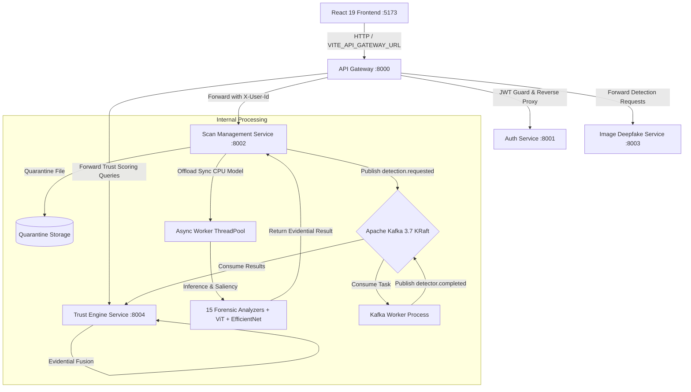

# TrustNet AI — System Architecture Specification

## 1. System Overview

**TrustNet AI** is a multimodal synthetic media verification platform designed to defend information integrity by detecting deepfakes, manipulated artifacts, and AI-generated content.

In Phase 1, the platform implements a high-precision **Image Deepfake Detection** architecture featuring:
- Physics-informed forensic heuristics (FFT, CFA demosaicing, Gabor texture, ELA, PRNU noise).
- Neural Vision Transformers (ViT) & EfficientNet-B0 convolutional backbones.
- LM Studio local vision AI reasoning.
- Visual explainability via Grad-CAM saliency heatmaps.
- Calibrated evidential risk scoring ($0-100$).
- Strict perimeter security via a centralized API Gateway.

---

## 2. Global Architecture Flow

---

## 3. Communication & Gateway Boundary Principle

### Architectural Invariant: Single Ingress Point
- The browser **never** communicates directly with internal microservices on ports 8001, 8002, 8003, or 8004.
- All client network traffic flows strictly to the **API Gateway** on port `8000` via the configurable `VITE_API_GATEWAY_URL`.
- The Gateway validates JWT tokens via [`shared/auth/verify_token.py`](file:///c:/Users/Alok/Desktop/MY_PROEJCT/TrustNetAi/TrustNet-Ai/shared/auth/verify_token.py) and decorates forwarded requests with authenticated internal context (`X-User-Id` and `X-User-Role`).

---

## 4. Communication Protocol: Dual Sync/Async Pipelines

TrustNet AI supports two distinct execution paths:

### 1. Synchronous Evidential Deepfake Analysis
- Endpoint: `POST /api/v1/scans/analyze`
- Best for interactive analyst workstations requiring instant reports.
- Dispatched through Gateway to Scan Management.
- CPU-intensive neural transforms and Gabor/FFT filters are offloaded to worker threads via `run_in_threadpool`, ensuring FastAPI's async event loop remains fully responsive.
- Results are saved to the scan database and returned immediately with complete forensic analyzer telemetry.

### 2. Asynchronous Kafka-First Pipeline
- Endpoint: `POST /api/v1/scans/upload`
- Best for bulk media ingestion, automated queues, and distributed workers.
- Uses **Apache Kafka 3.7 (KRaft mode)**:
  - `detection.requested.image_deepfake`: Emitted by Scan Management upon file quarantine.
  - `detector.image_deepfake.completed`: Emitted by Image Deepfake Service when inference and explainability processing complete.
- Trust Engine consumes completed detector events, applies the cross-service evidential fusion algorithm, and finalizes the Trust Score.

---

## 5. Security & Ingestion Defense

Every file upload is validated through defense-in-depth:
1. **Size Enforcement**: Strict 15MB ceiling (`HTTP 413 Content Too Large`).
2. **Magic Byte Verification**: Verified using PIL/Pillow header inspection (`HTTP 400 Invalid Image Bytes`).
3. **Path Traversal Protection**: Storage keys are sanitized using `os.path.basename` and checked for `..` directory traversal sequences.
4. **CORS Hardening**: Strict origin whitelist configured via `CORS_ALLOWED_ORIGINS` (wildcard `*` is automatically stripped in production).
5. **No Production Auth Bypass**: Mock/developer tokens are rejected unconditionally in production (`MOCK_AUTH_DISABLED`).

---

## 6. Frontend Architecture (React 19 + TypeScript + Vite)

The UI is organized as a specialized forensic security workstation:
- **Modular API Suite** (`frontend/src/services/api/`):
  - `client.ts`: Central HTTP client routing strictly to `VITE_API_GATEWAY_URL`.
  - `auth.api.ts`, `scan.api.ts`, `trust.api.ts`, `detection.api.ts`: Specialized domain APIs.
- **Interactive Forensic Labs**:
  - Spatial Saliency / Grad-CAM heatmap viewer with adjustable opacity and zoom.
  - Sub-Pixel Bayer CFA demosaicing & Laplacian edge micro-structure canvas.
  - Error Level Analysis (ELA) compression surface analyzer.
- **Native Offline Speech**: Report debrief readouts generated using the browser's native `window.speechSynthesis` API without external cloud audio dependencies.
- **Client-Side PDF Exporter**: High-resolution forensic audit dossiers generated via `jspdf`.
